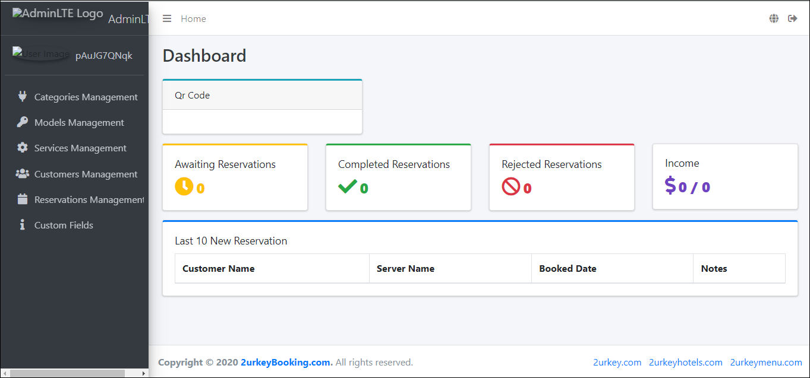
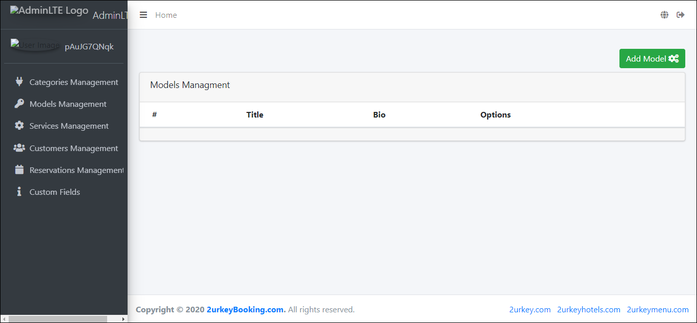

## Installation
 - create .env from .env.example
 - create new db
 - config .env file by you db configs
 - php artisan migrate --seed
 - php artisan serve
 - login with this super-admin@gmail.com as email
 - password as password

## License

The Laravel framework is open-sourced software licensed under the [MIT license](https://opensource.org/licenses/MIT).
